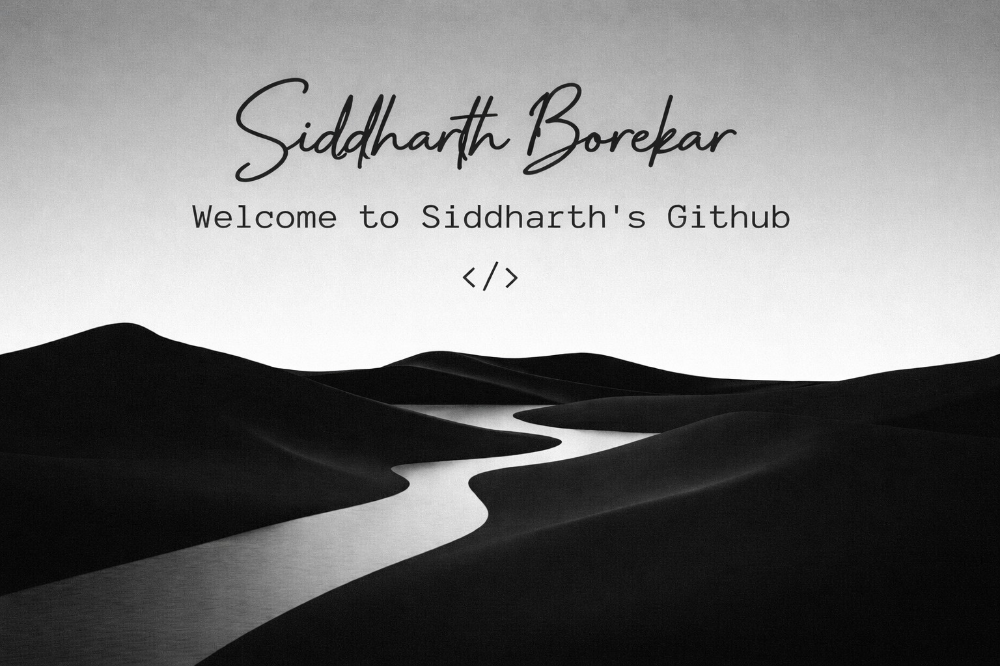

  

  

  

  

 

<h2 align="center"> 👋 <em>About Me</em></h2>

  Hello! <b>I'm Siddharth Borekar</b>, a Computer Science student from India 🇮🇳.  
  I enjoy learning new technologies and solving problems.  
  Currently, I'm working on projects using Web Development and Databases.

 

   🎓 <b>Computer Science Student</b> 
   💻 <b>Interested in Web Development & Databases</b> 
   🧠 <b>Learning SQL, C++, and Backend Development</b> 
   🚀 <b>Building Projects using Vite + Tailwind</b> 

  

<h2 align="center"> 🛠 <em>Technologies</em> </h2>

  
  
  
  
  
  
  
  
  
  
  
  

  

<h2 align="center"> 🚀 <em>Projects</em> </h2>

  🔹 Gym Management App (In Progress) 
  🔹 Student Database System (SQL Project) 

  

<h2 align="center"> 📊 <em>Statistics</em> </h2>

 

  

  

<h2 align="center"> 📫 <em>Contact Me</em> </h2>

  📧 yourmail@gmail.com

